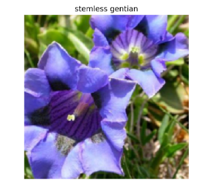

# Image Classification Application

# 1. Project Description
This project will implement an image classification application that can be used to classify images of different objects. The application will first train a deep learning model on a dataset of images. Then, the trained model will be used to classify new images.
(top5.png)
# 2. Project Goals:

* The goals of this project are to:
* Learn how to implement an image classification application
* Gain experience with deep learning models
* Develop a working image classification application
